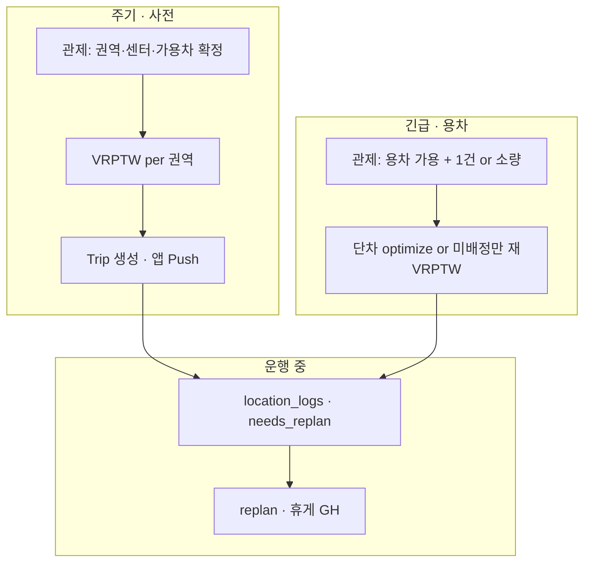

# RouteOn 배차·알고리즘 플랜

중소 물류 회사 기반 **관제 웹 · 기사 앱 · 백엔드** 분리 개발.

| 영역 | 담당 | 비고 |
|------|------|------|
| **알고리즘** | 본인 | TSP/VRPTW, 휴게 삽입, GraphHopper, API 계약 (`backend/app/services/`, `optimize.py`) |
| **관제 웹** | 별도 | Kakao 지도 API, 배차 입력·모니터링 |
| **기사 앱** | 별도 | Kakao 내비 SDK, `/optimize/`, `location-logs`, `replan` |

---

## 1. 현재 상태와 문제

- 운영 UX는 **차량 1대 = Trip 1건** (`POST /optimize/`) 중심.
- **다차량 계산 API**는 있음: `POST /optimize/dispatch` (OR-Tools VRPTW + 차량별 `route[]` 순서·휴게). **응답까지 구현**; 앱·웹 계약은 `route[]` 순서와 `lat`/`lon` 중심이고, `polyline`은 선택 디버그 필드. 주문·Trip DB 반영은 Phase 1 (README §5·§8·§17, 본 문서 §6·§8).
- DB **`dispatch_groups` / `dispatch_orders`** 스키마는 있으나 VRP 결과 → Trip 저장 **파이프라인 미연결** (SCHEMA.md 「차후 구현」).
- 실무는 **다차량·상시 배차**인데, 전국 50건을 한 번에 넣으면 **느리고** 현실과도 안 맞음 → **배차 기준점**을 먼저 정해야 함.

---

## 2. 중소 물류 현실 (전제)

한 회사가 **간선·지선·용차 중 하나만** 하는 경우는 드묾. 보통 **혼재**한다.

| 운영 유형 | 특징 | 배차·알고리즘 시사점 |
|-----------|------|----------------------|
| **간선** | 거점↔거점, 장거리·고정에 가까움 | 권역·센터 간 **허브**; depot 명확; 주기·시간표 중요 |
| **지선** | 센터↔납품지, 당일·권역 밀집 | **권역 VRPTW**에 적합; 건수 많아도 **공간 단위**로 쪼개면 차 대수·계산 시간↓ |
| **용차** | 필요할 때만 투입, 긴급·피크 | 가용 차 목록에 **당일만** 포함; 고정 노선 최적화와 **분리** |

| 소속 | 특징 | 배차·알고리즘 시사점 |
|------|------|----------------------|
| **직영** | 기사·차량·센터가 회사 소속 | 센터 depot, GPS·Trip 이력 **신뢰도 상대적 높음** |
| **지입** | 차주·기사 혼재, 전날 타사/upstream 운행 가능 | **전날 누적 근무·가용 시간**은 **관제 확인**이 정확; 단일 depot VRPTW만으로는 부족할 수 있음 |

| 발생 패턴 | 예 | 기준점 |
|-----------|-----|--------|
| **주기 배송** | 매주 화·목 동일 거래처 (간선/지선) | `delivery_points` 반복 + **권역·센터** 고정 |
| **전날·사전 예약** | 익일 50건 확정, 새벽 배차 | **배치 시각** `scheduled_at` + **권역별** 1회 VRPTW |
| **긴급** | 당일 추가·용차 투입 | 기존 묶음 **재배차** 또는 **1대 1건** `optimize` / 소규모 replan |
| **전국 vs 도·광역** | 같은 50건이라도 전국이면 차 많음, 경기 밀집이면 차 적음 | **공간 기준점(권역)** 이 필요 차량 수를 좌우 |

> **12시간 등 숫자는 예시.** 잔여 근무·당일 투입 가능 여부는 **관제가 차량별로 판단**하고, 알고리즘은 그 결과를 **입력**으로만 받는다.

---

## 3. 배차 기준점 (핵심)

**계산 시간·품질의 1순위는 OR-Tools 튜닝이 아니라, 아래 기준으로 문제 크기 \((n, M)\)을 자르는 것.**

풀기 전에 관제(또는 웹 UI)가 **기준점을 확정** → 알고리즘은 **그 범위 안에서만** VRPTW · TSP · 휴게.

### 3.1 공간 기준 — 권역 · 센터 · depot

| 항목 | 누가 정함 | 알고리즘 |
|------|-----------|----------|
| **권역** | 관제 (도·광역·영업구역·센터 권역) | 권역마다 **별도 VRPTW** (전국 50건 1방 ≠ 경기 50건 1방) |
| **센터(depot)** | 관제 (`centers` / 당일 집결지) | 해당 권역 주문만 + **가용 차 M대** |
| **지입 출발** | 관제: “오늘 이 차는 ○○에서 출발” | 차량별 **depot 다름** → multi-depot 또는 **차량별 소배치** (Phase 3) |

```
주문 N건
  → [관제] 권역·센터·depot 확정
  → [알고리즘] 권역 i: VRPTW(n_i, M_i)  →  차량별 방문 순서
  → [알고리즘] 차량별 TSP + 휴게 (GH)
  → [앱] 출발·도착 선택 후 주행 · replan
```

### 3.2 시간 기준 — 배치 · 주기 · 긴급

| 유형 | 관제 | 알고리즘 입력 |
|------|------|----------------|
| **주기(간선/지선)** | 반복 거래처·요일·기본 시간창 | `delivery_points` + `tw_open`/`tw_close` (또는 orders 오버라이드) |
| **사전(전날) 배차** | 익일 묶음 1개 `DispatchGroup`, 권역별 확정 | `scheduled_at` 기준 **절대 시간창**으로 VRPTW (Phase 4) |
| **당일 긴급** | 기존 group에 추가 or 용차 1건 | 소량이면 **단차** `optimize`; 다수면 **권역 재VRPTW** 또는 unassigned만 재할당 |
| **24/365** | 교대·야간은 **배치 단위**로 쪼갬 (한 번에 24h VRP X) | 새벽 배치 / 당일 삽입 / 운행 중 replan **역할 분리** |

### 3.3 차량·기사 기준 — 가용 · 소속 · 운영형태

관제가 **VRPTW에 넣을 차만** 골라 넘긴다. (자동만으로 전날 피로·지입 외부 운행 판단 불가)

| 필드 (계약 초안) | 의미 | 비고 |
|------------------|------|------|
| `vehicle_id` / `driver_id` | 직영·지입 식별 | 웹·백 CRUD |
| `employment_type` | `direct` \| `owner_operator` | 지입은 가용·출발지 수동 비중 ↑ |
| `operation_type` | `trunk` \| `branch` \| `chartered` | 용차는 **당일 chartered만** 후보에 |
| `available_from` / `available_until` | 당일 쓸 수 있는 시각 구간 | ISO 또는 `scheduled_at` 상대 초 |
| `initial_drive_sec` / `remaining_drive_budget_sec` | 배차 전 이미 소모한 연속 운전·근무 | 관제 입력 · 단차·replan과 동일 개념 |
| `can_assign` | false면 VRPTW 후보 제외 | 관제 일괄 off |
| `home_depot` or `start_lat/lon` | 지입 당일 출발 | depot 1개 가정 완화 |

시스템은 **어제 Trip·운행시간으로 “확인 필요” 힌트**만 (선택). **제외 여부는 관제 확정.**

### 3.4 주문(건) 기준 — 한 VRPTW 묶음에 무엇을 넣나

| 포함 | 제외·별도 처리 |
|------|----------------|
| 같은 **권역** + 같은 **배치**(`dispatch_group_id`) + 같은 **시간대** | 다른 권역 → 다른 VRPTW |
| 지선·간선 **당일 확정 건** | 용차는 **후보 차량 타입=chartered** 또는 별도 요청 |
| 하차 중심 depot 왕복 (현 `dispatch` API) | 상·하차 쌍 많으면 **pickup-delivery VRP** (Phase 2) |

---

## 4. 운영 유형별 배차 흐름 (요약)



| 패턴 | 기준점 우선순위 | API (현재·예정) |
|------|-----------------|-----------------|
| 지선 50건 / 경기 | **권역 → 센터 depot → 가용 M대** | `dispatch` → (예정) Group+Trip 저장 |
| 간선 서울↔부산 | **허브 2 depots** or 간선 전용 1건 1노선 | 단차 `optimize` 또는 간선 전용 템플릿 |
| 용차 긴급 3건 | **chartered 가용만**, 소규모 n | `optimize` 또는 소형 VRPTW |
| 지입 오전만 가능 | **available_until**, 출발 좌표 | VRPTW 시간창 + 관제 필터 |

---

## 5. 알고리즘 로드맵 (본인 범위)

| Phase | 내용 | 산출 |
|-------|------|------|
| **0** | README·§17·§12 정합, VRPTW 테스트(`test_vrptw.py`), `unassigned`·용량 시나리오, SCHEMA·모델 갭 목록 | 문서·테스트 |
| **1** | `dispatch_orders` → VRPTW → **Trip·Group DB 저장**, `visit_order` | 웹·백과 API 계약 |
| **2** | 다차량 **상차→하차** (pickup-delivery) | SCHEMA orders 반영 |
| **3** | **지입** · 차량별 출발 · multi-depot / 권역 클러스터 | `centers`, 차량별 depot |
| **4** | **절대 시간창** (`scheduled_at`, deadline), 당일 재배차 | 24/365 배치 단위 |

**웹·앱**: Group UI, 주문 테이블, 가용 차 체크리스트, 지도, Push — **§3 기준점 입력 UI**.

---

## 6. 현재 코드와의 매핑

| 기능 | 상태 |
|------|------|
| 단차 TSP + cargo + replan + GH 휴게 | ✅ |
| `POST /optimize/dispatch` (VRPTW, depot 왕복, 용량·시간창) | ✅ 계산만, DB 미저장 |
| 권역 분할 · 가용차 필드 · 운영형태 | ❌ PLAN §3 계약 → Phase 1~3 |
| `dispatch_groups` / `dispatch_orders` 파이프라인 | ❌ Phase 1 |

---

## 7. 한 줄 원칙

> **중소 물류는 간선·지선·용차와 지입·직영이 섞인다. 배차는 「전국 N건」이 아니라 「권역 × 배치 × 운영형태 × 관제가 확정한 가용 차」 단위로 쪼개고, 그 안에서만 VRPTW·경로를 계산한다.**

---

## 8. PLAN 구조 도입 시 영향·구현 순서 (아키텍처 초안)

팀장 확정 전 **설계 메모**. 상세 갭 분석은 스키마(SCHEMA)·`init_tables.sql`·`app/models` 대조 후 갱신한다.

### 8.1 현재 백엔드 요약

- **단차**: `POST /optimize/` — `Trip` 기반 TSP, `cargo_id`/`cargo_role`, GraphHopper 행렬, 휴게 삽입.
- **다차량**: `POST /optimize/dispatch` — 요청 본문만으로 VRPTW·차량별 `route[]` 순서·휴게 계산; **응답 반환만**, 주문/`dispatch_orders` 테이블과 **미연결**. 응답 `polyline`은 선택 디버그 필드이며 제품 계약의 중심은 `route[]`의 순서와 `lat`/`lon`.
- **모델**: `DispatchGroup`, `Trip.dispatch_group_id` 존재. **`DispatchOrder` ORM 없음** — SCHEMA의 `dispatch_orders`·`centers`와 DB 실물/시드 **정렬이 Phase 1 선행 과제**.

### 8.2 도입 시 영향 (요약 표)

| 영역 | 영향 | Breaking | 담당 |
|------|------|----------|------|
| 알고리즘 | 권역별 `(n_i, M_i)` 호출 분할; Phase 2~4 PDVRP·multi-depot·절대 시간창 | 상대 초만 가정한 클라이언트는 Phase 4 전후 **계약 정리** 필요 | 팀장(알고리즘) |
| API·백엔드 | Phase 1: 주문 로드 → VRPTW → **Trip·주문 필드 반영**, 그룹 상태 전이 | 응답·필수 필드 변경 시 웹·앱 동시 통지 | 팀장 + 팀원 1 |
| DB | `dispatch_orders` 등 마이그레이션·ORM; `DispatchGroup`과 SCHEMA(`center_id` 등) **한 원천** 확정 | ENUM·NOT NULL·백필 | 팀원 1 주도, 팀장 합의 |
| 관제 웹 | 권역·배치·가용차 UI, 미배정 표시 | API 필드 확장 | 팀원 1 |
| 기사 앱 | 다건 배차 시 **Trip 다건**·그룹 단위 UI 여부 | 단일 trip 가정 | 팀원 2 |

### 8.3 리스크·결정 대기

- SCHEMA / `init_tables` / ORM 불일치로 Phase 1 범위가 커질 수 있음.
- 시간창: 현재 dispatch는 **출발 기준 경과 초**; `scheduled_at`·ISO 절대 시각(Phase 4) 도입 시 **변환·타임존** 규칙 확정 필요.
- 재배차 시 Trip 갱신 vs 신규 Trip **멱등 정책** 필요.

### 8.4 엔지니어 구현 순서 (제안)

1. **Phase 0** (진행 중): README·§17과 실제 구현 정합; `solve_vrptw` **미배정·용량** 시나리오 테스트(`backend/tests/test_vrptw.py` 등); SCHEMA·모델 갭 목록화.
2. **Phase 1**: `dispatch_orders`(·`centers`) 테이블+ORM; `DispatchGroup` 필드 정렬; **VRPTW 실행 후 DB 반영** 서비스 및 API(예: `dispatch` 저장형 엔드포인트); 소규모 통합 테스트.

---

상세 API·스키마: [README.md](README.md) (섹션 5·8·12·17), [SCHEMA.md](SCHEMA.md), Swagger `/docs`.
