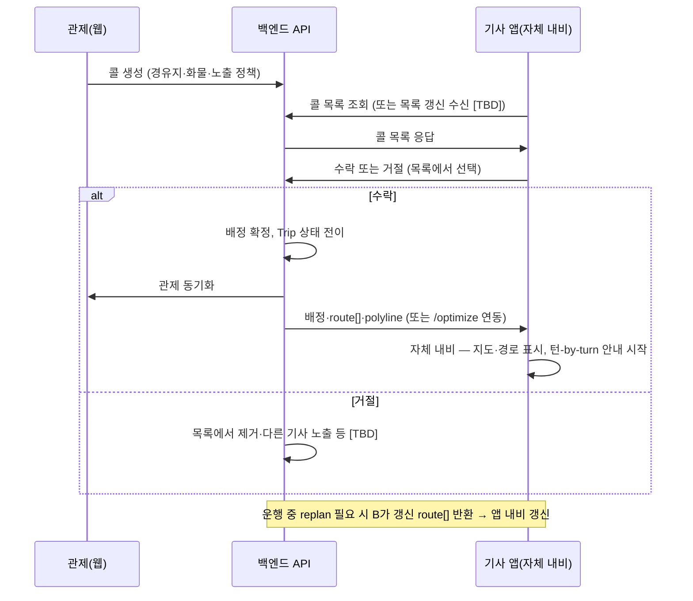
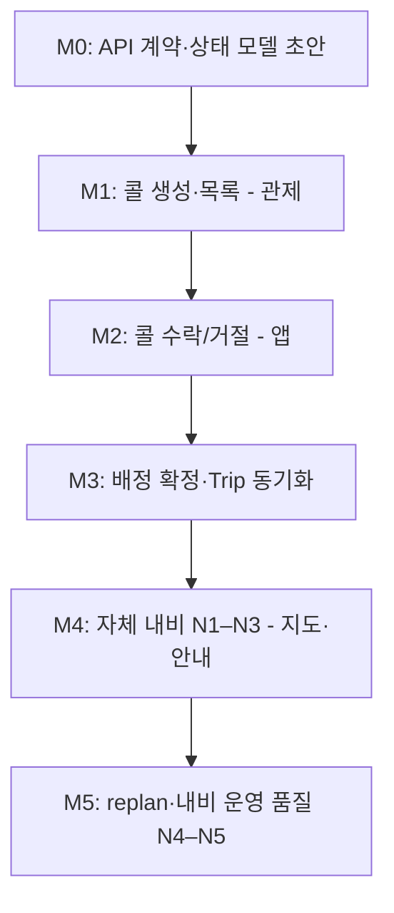

# RouteOn — 제품·기술 계획 (팀 공유용)

**지입기사(독립·위탁 기사)** 운영을 **택시 콜(ride-hailing)** 모델에 가깝게 설계하고, **기사 앱 내 자체 내비게이션** 개발을 핵심 마일스톤·제품 축으로 추진한다.  
미확정 세부(API·스키마·화면·정책·기술 스택)는 **`[TBD]`** 또는 **후보**로 표기하며, **breaking API·스키마 변경은 팀장 확정 후** 문서·코드에 반영한다.

---

## 1. 프로젝트 다음 단계 개요

### 배경

RouteOn은 화물 운행 **경로 최적화 백엔드**(`POST /optimize/`, `POST /optimize/replan` 등)를 이미 갖추고 있다. 다음 단계는 이 결과를 **실제 운영 흐름**에 연결하는 것이다.

| 축 | 한 줄 요약 |
|----|------------|
| **지입기사 콜 모델** | 관제에서 운행 요청(콜) 생성 → **기사 앱 콜 목록(배차판)에 노출** → 기사가 목록에서 **수락/거절** → 배정·운행 상태 관리 |
| **자체 내비게이션** | 기사 앱에서 백엔드 `route[]`·`polyline`을 받아 **지도·경로·턴-by-turn 안내**를 직접 구현; 운행 중 변경은 `replan` 연동 |

### 기존 백엔드 코어 (유지·연동 전제)

- 경로 최적화·재탐색 API: `POST /optimize/`, `POST /optimize/replan`, 데모 `POST /demo/route`
- GraphHopper·거리/시간 행렬, 방문 순서 계산 등 `backend/app/services/` 파이프라인
- 필드 계약 요약: [README.md](README.md), [SCHEMA.md](SCHEMA.md)

위 API는 **현 상태를 유지**한 채 콜 배차·내비 축과 **연동**한다. 엔드포인트·응답 필드 변경은 팀장 확정 후 반영.

### 성공 기준 (개념)

1. 관제에서 콜을 만들고, 기사 앱 **콜 목록**에서 기사가 **수락 또는 거절**할 수 있다.
2. 수락된 콜이 **배정 확정**되면 Trip·운행 상태가 관제·앱에 동기화된다.
3. 기사 앱 **자체 내비**로 `route[]` 순서대로 안내를 시작할 수 있다.
4. 운행 중 경로 변경이 필요할 때 `replan` 결과를 앱이이 반영할 수 있다. *(트리거·UX는 `[TBD]`)*

---

## 2. 지입기사 콜 모델

### 2.1 대상 사용자

| 역할 | 설명 |
|------|------|
| **관제 담당자** | 운행 요청 등록, 콜·기사·Trip 모니터링, 재배정·취소 등 운영 |
| **지입기사** | 자영·위수탁 등 **독립/위탁** 화물 기사. 앱 **콜 목록**에서 콜 확인·수락/거절·운행 |
| **시스템(백엔드)** | 콜·배정·Trip 상태, 경로 계산, 위치 로그 수집 |

### 2.2 유저 스토리 (예시)

**US-1 — 콜 생성**  
관제 담당자는 상·하차지·화물 정보·희망 시간 등을 입력해 **콜**을 생성한다. 시스템은 해당 콜을 **기사 앱 콜 목록(배차판)** 에 노출할 수 있는 상태로 등록한다. *(노출 대상 기사 범위·필터는 `[TBD]`; 후보 탐색·대기열 방식은 보조 후보)*

**US-2 — 콜 수신·응답**  
기사 앱은 **콜 목록(리스트)** 화면에서 수신 가능한 콜을 보여 준다. *(택시 앱 배차판 UX 벤치마크)* 기사는 목록에서 콜을 선택해 **수락** 또는 **거절**한다. 목록 갱신 방식(폴링·WebSocket 등)·거절 후 목록 처리·동시 다발 콜 정책은 `[TBD]`. 푸시 알림은 **보조 후보**(목록 진입 유도용).

**US-3 — 배정 확정·운행 시작**  
수락이 확정되면 Trip이 **배정됨 → 운행 중** 등으로 전이한다. 관제 화면과 기사 앱 상태가 일치한다.

**US-4 — 운행 중 모니터링**  
관제는 기사 위치·Trip 상태를 본다. 기사는 앱에서 다음 경유지·내비 안내를 본다.

**US-5 — 운행 변경**  
경유지 추가·순서 변경·현재 위치 기준 재계산이 필요하면 `replan`을 호출하고 결과 `route[]`를 반영한다. *(누가·언제 트리거하는지 `[TBD]`)*

**US-6 — 운행 종료**  
기사 또는 관제가 운행 완료를 처리한다. 이후 사후 통계·정산 등은 **별도 문서·Phase** — [docs/POST_TRIP_STATS_ERD.md](docs/POST_TRIP_STATS_ERD.md) 참고, 본 PLAN 범위 밖.

### 2.3 운영 플로우 (개념)

### 2.4 상태 전이 (후보, 확정 전)

아래는 **후보** 모델이다. 엔티티명·상태값·전이 규칙은 팀장 확정 후 [SCHEMA.md](SCHEMA.md)에 반영한다.

| 개념 | 후보 상태 예시 |
|------|----------------|
| **콜** | `pending` → `listed`(목록 노출) → `accepted` / `rejected` / `expired` / `cancelled` *(상태명·`offered` 등은 후보)* |
| **Trip(운행)** | `assigned` → `in_progress` → `completed` / `cancelled` |
| **기사 가용성** | `offline` / `available` / `on_trip` / `busy` `[TBD]` |

### 2.5 역할 분리

| 기능 | 관제 웹 (팀원 1) | 백엔드 API (팀원 1 + 계약 협의) | 기사 앱 (팀원 2) |
|------|------------------|----------------------------------|------------------|
| 콜 생성·수정·취소 | UI·폼 | 콜·Trip CRUD, 검증 | — |
| 기사 목록·지도 모니터링 | **OSM 기반 지도**(MapLibre GL 등), 상태 패널 | 기사·위치·Trip 조회 API | 위치 주기 전송 |
| 콜 목록·수락/거절 | (선택) 콜·배정 모니터링 뷰 | **콜 목록 API**, 배정·수락 경합 처리, 타임아웃 `[TBD]` | **콜 목록(배차판) UI**, 콜 카드, 수락/거절 버튼 |
| 경로·순서 | 지도에 `route[]` 표시 (모니터링) | `/optimize`, `/replan` | **자체 내비** — 경로·경유지·안내 UI |
| 재탐색 | (선택) 관제에서 요청 | `replan` 처리 | 앱 자체 내비에 갱신 `route[]` 반영 `[TBD]` |

---

## 3. 자체 내비게이션 개발 계획

**주 담당: 팀원 2 (기사 앱 + 자체 내비).** 백엔드는 `route[]`·`polyline`·`replan` **계약**을 제공하고, 팀장은 최적화·재탐색 로직을 유지한다.

**범위 밖·대안:** Kakao 내비 SDK·타사 내비 앱 **딥링크 연동**은 본 프로젝트 핵심 범위가 아니다. PoC·비상 대안으로만 검토 가능하며, 제품 축은 **앱 내 자체 내비**이다.

### 3.1 목표

- 배정(또는 운행 시작) 시점에 백엔드 `route[]`의 **`lat`, `lon`, 방문 순서**를 기사 앱 **자체 내비 화면**에 반영하고 **턴-by-turn 안내**를 시작한다.
- 상·하차 구분은 `cargo_id` + `cargo_role` (`pickup` / `delivery`)로 경유지 라벨·안내 순서와 맞춘다. *(표시 UX `[TBD]`)*
- **지도 렌더링**은 관제 웹·기사 앱 모두 **OSM 기반**(MapLibre GL / OSM+타일 등)을 기본 방향으로 한다. 관제는 **모니터링·배차**용, 기사 앱 자체 내비는 **운전 중 안내**용으로 역할을 분리한다. Kakao Map API·Mapbox 등 **상용 지도 렌더링 API**는 사용하지 않는다.

### 3.2 개념적 구성요소 (후보, 미확정은 `[TBD]`)

| 구성요소 | 설명 | 기술 후보 `[TBD]` |
|----------|------|-------------------|
| **지도 렌더링** | 차량 위치·주변 도로·줌/팬 | **OSM 기반** — MapLibre GL, OSM+타일(공개·셀프호스팅) 등 `[TBD]` 세부 스택. 상용 지도 API(Kakao Map, Mapbox 등)는 **범위 밖** |
| **경로 표시** | `polyline`·세그먼트 하이라이트, 경유지 마커 | 백엔드 `polyline` + 클라이언트 오버레이 |
| **턴-by-turn 안내** | 다음 회전·거리·도착 예상, 경유지 도착 판정 | 백엔드 `route[]` 순서 + `[TBD]` 매칭/스냅 로직 |
| **위치 추적** | GPS 주기 수집, 지도 상 차량 아이콘 갱신 | OS 네이티브 위치 API, 백그라운드 정책 `[TBD]` |
| **음성·UX** | 음성 안내, 야간 모드, 다음 경유지 카드 | TTS·햅틱 등 `[TBD]` |
| **백엔드 연동** | 배정 시 `route[]` 수신, 운행 중 `replan` 반영 | `/optimize`, `/replan`, 위치 로그 API |
| **앱 프레임워크** | 기사 앱·내비 UI 전체 | React Native, Flutter, 네이티브(iOS/Android) `[TBD]` |

### 3.3 개발 단계 (마일스톤 후보 N1–N5)

| 단계 | 내용 | 담당 |
|------|------|------|
| **N1 — 계약·스택 초안** | `/optimize`·`/replan`·`route[]`/`polyline` 필드 합의; **OSM 기반** 지도·앱 프레임워크 **후보** 정리 | 팀장 + 팀원 2 |
| **N2 — 지도·경로 PoC** | 샘플 `route[]`·`polyline`으로 지도 표시, 경유지 마커·경로 오버레이 | 팀원 2 |
| **N3 — 턴-by-turn·배정 연동** | 콜 수락 후 Trip `route[]`로 안내 시작; 위치 추적·다음 안내 UI | 팀원 2 + 팀원 1(API) |
| **N4 — replan 반영** | 운행 중 갱신 `route[]` 수신 → 경로·안내 상태 갱신 UX | 팀원 2 |
| **N5 — 운영 품질** | 백그라운드 안내, 음성 TTS, 오프라인·재연결, 성능 — `[TBD]` | 팀원 2 |

### 3.4 백엔드 계약 (고수준, 현행 기준)

| API | 앱·관제에서 쓰는 핵심 |
|-----|------------------------|
| `POST /optimize/` | 초기 방문 순서·`route[]`·`polyline` (배정 직전/직후 경로 산출) |
| `POST /optimize/replan` | `remaining_waypoints`, 현재 위치 등 — 미완료 구간 재계산 |

#### 3.4.1 `optimize_mode` (단건 최적화 1단계)

동일 엔드포인트 `POST /optimize/`에 optional `optimize_mode` (`basic` \| `with_rest`, 기본 `with_rest`). **다차량 VRP는 범위 밖.**

| 모드 | 용도 | 파이프라인 |
|------|------|------------|
| **`basic`** | 단순 길찾기·내비 | 출발→경유(요청 순서 고정)→목적, GH 행렬/경로, **휴게 삽입 생략** |
| **`with_rest`** | 프로젝트 핵심 (기본) | TSP → GH → **법정 휴게 삽입** (기존과 동일) |

- **`replan`**은 `with_rest` 계열 유지 — 요청에 mode 없음, TSP·휴게 삽입 그대로.
- breaking 최소: 필드 optional + default `with_rest` → 기존 클라이언트 호환.

#### 3.4.2 전용 엔드포인트·파이프라인 모듈 (2단계)

내부 로직은 `backend/app/services/route_pipeline.py`로 분리. API 라우트는 얇은 wrapper.

| 엔드포인트 | 파이프라인 | 비고 |
|------------|------------|------|
| `POST /optimize/basic` | `run_basic_optimize` | 요청 `optimize_mode` **무시**, basic 강제 |
| `POST /optimize/with-rest` | `run_with_rest_optimize` | 요청 `optimize_mode` **무시**, with_rest 강제 |
| `POST /optimize/` | `optimize_mode`로 위임 | 기본 `with_rest` — 1단계 호환 유지 |
| `POST /optimize/replan` | `run_replan_with_rest` | with_rest 계열, 변경 최소 |

- 공통 헬퍼: 노드 구성(`prepare_optimize_nodes`), GH 행렬, TSP 순서, 휴게 삽입, `optimized_route` DB 저장·`route_version`.
- GH 행렬 503 fail-fast·replan `optimized_route`/`route_version` 반영(eb7bd91, CHANGELOG). 다차량 VRP 없음.

| 위치 로그 | `[TBD]` 엔드포인트·주기 — [SCHEMA.md](SCHEMA.md) 및 기존 `location_logs` API와 정합 |

- **클라이언트 계약의 중심은 `route[]` 순서와 좌표**; `polyline`은 경로 시각화·턴 매칭에 활용 (자체 내비 확장 시 역할 재정의 가능 — `[TBD]`, [README.md](README.md)와 교차 검증).
- 턴-by-turn에 필요한 **추가 필드**(구간 거리·예상 시간·매뉴버 힌트 등)는 내비 PoC 후 팀장 확정 — `[TBD]`.

### 3.5 관제 웹과의 관계

- **관제(팀원 1):** **OSM 기반 지도** 위에 동일 Trip의 `route[]`·`polyline`·기사 위치를 **모니터링**한다. 운전 안내 UI는 제공하지 않는다.
- **기사 앱(팀원 2):** **자체 내비**(동일 OSM 기반 베이스맵)로 동일 데이터를 운전 중 안내에 사용한다.
- 양쪽 **데이터 소스 일치**(같은 Trip·같은 `route` 버전) — `[TBD]` (버전 필드·갱신 시점). 베이스맵·타일은 **3.6.5**, 실시간 교통은 **3.7** 참고.

### 3.6 자체 내비 — 필요 자료·데이터 계약 (초안)

기사 앱 **자체 내비**와 관제 **OSM 기반 지도**가 소비할 **백엔드·엔진 산출물**을 정리한다. 제품 방향은 **상용 지도·내비 SDK 미사용**, **OSM 기반 렌더링 + GraphHopper + 백엔드 최적화 파이프라인** 중심이다. 아래 표·후보는 **확정 전 초안**이며, breaking API·응답 필드 추가는 **팀장 확정 후** `SCHEMA.md`·구현에 반영한다.

#### 3.6.1 내비 클라이언트가 소비하는 데이터 카테고리

| 카테고리 | 내용 | 앱·관제 용도 |
|----------|------|----------------|
| **경로 기하** | 도로를 따르는 좌표열 `polyline` — 현재 코드는 GH `points_encoded=false` → `[[lat, lon], ...]` (디코딩된 좌표). 구간(leg)별 geometry 분할은 `[TBD]` | 지도 경로 오버레이, GPS 스냅·이탈 판정, 카메라 bbox |
| **방문 순서** | `route[]` — 노드별 `type` (`origin` \| `waypoint` \| `destination` \| `rest_stop`), `name`, `lat`, `lon`, (선택) `min_rest_minutes` | 다음 경유지 카드, 도착·체류 판정, 휴게소 안내 |
| **상·하차 메타** | `cargo_id` + `cargo_role` (`pickup` / `delivery`) — **요청·`remaining_waypoints`에는 있으나** 현재 `route[]` 응답에는 미포함 | 상·하차 라벨·순서 검증 UI `[TBD]` |
| **턴-by-turn** | GH `instructions`: `text`, `distance`(m), `time`(초), `sign`(매뉴버 코드), `interval` (polyline 인덱스 `[start, end]`) | 다음 회전·거리·도로명 안내, 음성 TTS 입력 `[TBD]` |
| **집계 메타** | 총 거리·시간 (`total_distance_km`, `estimated_duration_min` 등), leg/segment 구분, `route` **버전** `[TBD]` | ETA(현재 **정적 GH** 기준 — 실시간 교통은 **3.7**), 진행률, 관제·앱 동기화 |
| **실시간·재탐색** | 현재 GPS (`current_lat`/`lon`), `replan`의 `remaining_waypoints`, `current_drive_sec` / `initial_drive_sec`, (서버) 누적 운전시간 | 법정 휴게 판단, 미완료 구간 재계산, replan 트리거 |
| **지도 표시 힌트** | polyline 기반 bbox, (선택) 줌·센터 힌트 `[TBD]` | 초기 카메라·경로 fit. **OSM 베이스맵·타일**은 클라이언트·인프라 (**3.6.5**, **6.2**) |

**클라이언트 계약 우선순위 (현행):** 방문 **순서·좌표**(`route[]`)가 1순위; `polyline`·`instructions`는 시각화·턴 안내용 보조·확장 자료. PoC 단계에서는 `demo` API로 기하·안내를 받고, 운영 API와의 통합 방식은 3.6.3 후보.

#### 3.6.2 현재 백엔드 제공 현황

코드 기준 (`optimize` / `replan` / `demo` / `graphhopper` 서비스, 2025-06 시점).

| 자료 | 현재 제공 | 제공 API / 필드 | 갭 |
|------|-----------|-----------------|-----|
| 방문 순서 `route[]` | **있음** | `POST /optimize/`, `POST /optimize/replan` → `route[]` (`type`, `name`, `lat`, `lon`, `min_rest_minutes?`); DB `trip.optimized_route.route` | 응답에 `cargo_id`/`cargo_role` 없음 — 클라이언트가 요청·`remaining_waypoints`와 매칭하거나 필드 추가 `[TBD]` |
| 총 거리·시간 | **있음** | `total_distance_km`, `estimated_duration_min`, `rest_stops_count` | leg 단위 거리·시간은 **응답 없음** (`demo/route`의 `legs`만 참고) |
| `polyline` (경로 기하) | **부분** | 내부: `graphhopper.get_route_geometry` / `get_route_with_stats` — optimize·replan 파이프라인에서 휴게 삽입용으로만 사용 | **운영 API 응답에 미포함**. 데모: `POST /demo/polyline`, `POST /demo/route` (`alternatives[].polyline`), `POST /demo/nav-route` |
| GH `instructions` | **부분** | `POST /demo/nav-route` — 휴게 삽입 후 경유지 포함 GH 재호출 시 `instructions[]` | `graphhopper.py` 래퍼·`/optimize`·`/replan` **미노출**. `street_name` 등 GH 원본 필드 전부 노출 여부 `[TBD]` |
| 구간 `legs` (노드 간 소요) | **부분** | `POST /demo/route` → `alternatives[].legs` (분 단위 float) | optimize·replan **미노출**; 내부 `segment_times`는 휴게 삽입에만 사용 |
| 대안 경로 | **부분** | `graphhopper.get_route_alternatives`; `POST /demo/route` 다중 대안 | 운영 API·앱 UX 연동 `[TBD]` |
| 거리/시간 행렬 | **있음 (내부)** | `graphhopper.build_time_matrix` — TSP·휴게용 | 클라이언트 직접 소비 **없음** (의도적) |
| replan 입력 계약 | **있음** | `current_lat/lon/name`, `current_drive_sec`, `remaining_waypoints`, `is_emergency`, 차량 스펙 등 | `accumulated_drive_sec` 서버 계산 vs 앱 전송 정책 `[TBD]` |
| 누적 운전시간 | **부분** | `location_logs` API — 위치·`driving_state` 수집; 서버 `_calc_accumulated_drive_sec` | 앱이 replan 시 `current_drive_sec`를 **직접 보내는** 현재 모델; 서버·앱 값 일치 규칙 `[TBD]` |
| `route` 버전·동기화 토큰 | **없음** | — | replan·관제·앱 간 **동일 경로 세트** 검증용 필드 필요 `[TBD]` |
| bbox / 카메라 힌트 | **없음** | 클라이언트가 polyline에서 계산 가능 | 서버 제공 여부 `[TBD]` |
| 베이스맵·타일 | **없음** (백엔드 미제공) | — | **OSM 기반** MapLibre·타일 호스팅 — 클라이언트·인프라 (**3.6.5**, **6.2**) |

**참고 — 데모 내비 응답 형태 (`POST /demo/nav-route`):** `polyline`, `instructions[]`, `total_distance_m`, `total_time_sec`, `rest_stops[]`. 운영 계약으로 승격 시 필드명·휴게 삽입 후 instructions 재계산 규칙을 팀장 확정.

#### 3.6.3 API 확장 후보 (`[TBD]`, 확정 전)

| 후보 | 설명 | 비고 |
|------|------|------|
| **A. optimize/replan 응답 확장** | `OptimizeResponse`에 `polyline`, `instructions`, `legs`(또는 `segment_times_sec`) 추가 | 한 번의 호출로 배정·내비 시작 가능. 응답 크기·캐시·breaking 변경 |
| **B. Trip 종속 guidance API** | 예: `GET /trips/{trip_id}/guidance` 또는 `POST .../nav` — 저장된 `route[]` 기준 GH 재호출 | optimize는 순서만, 기하·안내는 조회 시 생성. 버전·ETag와 궁합 `[TBD]` |
| **C. demo 계약 승격** | `/demo/nav-route`를 `/optimize/nav` 등으로 정식화 | PoC→운영 경로가 짧음; 인증·trip 바인딩 필요 |
| **D. 관제·앱 공통 계약** | 동일 Trip에 대해 **같은 `route[]` + 같은 `polyline`/`instructions` 세트** (또는 동일 `route_version`) | 관제·앱 모두 OSM 베이스맵 위에 **동일 엔진 산출물** 오버레이 `[TBD]` |

위 항목은 **상호 배타적이지 않음** (예: A로 메타만 확장 + B로 대용량 polyline 분리). **breaking 변경은 팀장 확정 후** 반영.

#### 3.6.4 replan·동기화 시 필요 자료

| 자료 | 역할 | 현재 |
|------|------|------|
| **`route[]` (갱신본)** | 미완료 방문 순서·휴게소 재삽입 결과 | replan 응답으로 제공 |
| **`remaining_waypoints`** | replan 요청 — 완료·스킵된 지점 제외, `cargo_id`/`cargo_role` 유지 | 요청 스키마에 정의 |
| **`current_drive_sec` / `initial_drive_sec`** | 법정 4시간 휴게·비상(`is_emergency`) 판단 | optimize: `initial_drive_sec`; replan: `current_drive_sec` |
| **`segment_times` (구간별 초)** | 휴게 삽입·구간별 누적 운전시간 | **내부만** — replan 응답·앱 노출 `[TBD]` |
| **`route_version` (가칭)** | 관제 지도 vs 앱 내비가 **같은 계획**을 보는지 검증; replan마다 증가 또는 해시 `[TBD]` | **없음** — M4–M5에서 확정 (6.2 참고) |
| **갱신 시점·주체** | 관제 선요청 vs 앱 자동 vs 서버 푸시 | `[TBD]` (2.5, 6.2) |

**동기화 원칙 (목표):** 한 Trip에 대해 관제·앱이 **동일 `trip_id`·동일 `route` 버전**의 `route[]`를 기준으로 하며, polyline/instructions는 그 순서에서 파생되거나 함께 버전링된다. 구현 방식(폴링·푸시·WebSocket)은 5.3 `[TBD]`.

#### 3.6.5 본 절 범위 밖

다음은 **자체 내비 “필요 자료” 문서화 범위 밖**이며, 클라이언트·인프라에서 별도 결정한다.

- OSM·MapLibre·기타 **베이스맵 타일 호스팅·스타일·오프라인 패키징** — 세부는 **6.2**
- **음성 TTS** 엔진·로케일·`instructions.text` vs 자체 문구 생성
- GPS **맵 매칭(map-matching)**·터널·드리프트 보정 알고리즘 (앱 책임 `[TBD]`)
- 차선 안내·속도 카메라 등 **상용 내비급** 부가 데이터
- **실시간 교통** — 문제 정의·후보는 **3.7** (본 절과 별도 과제)

### 3.7 실시간 교통 정보 (과제, `[TBD]`)

**OSM 기반 자체 내비 + GraphHopper**만으로는 **실시간 교통(정체·사고·공사)** 이 자동으로 반영되지 않는다. 베이스맵(OSM)과 교통 데이터는 별개이며, ETA·경로 재계산 품질은 **교통 소스·엔진 연동 방식**에 따라 달라진다. 아래는 **확정 전** 과제 정의이다.

#### 3.7.1 현재 코드 기준 (GraphHopper)

- `backend/app/services/graphhopper.py`는 GH `/route`에 **`profile=truck`**(기본값)으로 호출한다.
- 로컬 엔진(`Engine/config.yml`)은 **`truck_kr.json` custom model** — 화물 차량 제약·도로 선호 등 **정적 OSM 기반** 가중치이며, **실시간 교통 피드는 연동하지 않는다**.
- 시간 행렬(`build_time_matrix`)·`estimated_duration_min`·구간 `time_sec`는 위 **정적 프로필 ETA**에서 유도된다.

#### 3.7.2 갭 (문제 정의)

| 갭 | 설명 |
|----|------|
| **ETA 현실성** | 정체·사고 시 실제 소요와 `estimated_duration_min` 괴리 가능 |
| **경로 선택** | 동일 목적지라도 교통 상황에 따른 우회·대안 경로 미반영 (대안 경로 API는 있으나 교통 무관) |
| **replan 트리거** | 교통 악화만으로 자동 replan 여부·기준 `[TBD]` |
| **관제·앱 표시** | 지도에 정체 구간 오버레이·색상 구분 등 **교통 레이어** 없음 |

#### 3.7.3 후보 방향 (`[TBD]`, 상호 배타 아님)

| 후보 | 요약 | 비고 |
|------|------|------|
| **A. 교통 미반영 MVP** | 정적 OSM + GH truck profile ETA만 사용 | **캡스톤 1단계** 후보. 구현 부담 최소 |
| **B. 외부 교통 피드** | TomTom Traffic, HERE Traffic, 국내 **공공 ITS API** 등 — **지도 렌더링 API와 구분**, **교통 데이터만** 수신 | 유형별 우선순위는 **§3.7.5**. GH edge weight·ETA 보정·replan 연동 방식 `[TBD]` |
| **C. 자체 축적** | `location_logs`·기사 제보·구간별 히스토리로 혼잡 추정 | 데이터 축적·프라이버시·초기 콜드스타트 `[TBD]` |
| **D. 2단계 확장** | MVP는 A, 운영 품질 단계에서 B 또는 C 도입 | 마일스톤 **M5 이후** 또는 별도 Phase `[TBD]` |

**상용 지도 API(Kakao Map, Mapbox Maps 등)는 범위 밖**이나, **교통 전용 데이터 API**는 위 B 후보로만 검토한다(계약·비용·국내 커버리지는 `[TBD]`).

#### 3.7.4 캡스톤 범위 (후보)

- **1단계(MVP):** 교통 **미반영** — 정적 OSM·GH ETA로 배차·내비·관제 모니터링 동작 검증.
- **2단계(선택):** 교통 피드 또는 자체 추정 연동 — **1차는 §3.7.5 P0 소통 + P1 돌발** 후보. ETA·replan·지도 오버레이 도입 순서 `[TBD]`.

#### 3.7.5 공공 API 유형별 우선순위 (초안, `[TBD]`)

국내 공공 교통 데이터는 **ITS 국가교통정보센터** Open API(후보: `openapi.its.go.kr`, 공공데이터포털 `data.go.kr`) 등에서 제공된다. API명·엔드포인트·트래픽 한도는 **미확정**. 상용 지도 API와 구분하여 **교통 데이터만** 수신한다(§3.7.3 B).

| 유형 | 우선순위 | 학습·정적 대체 | MVP(1단계) | 2단계 | 비고 |
|------|----------|----------------|------------|-------|------|
| **교통 소통정보** | **P0** | 불가(실시간) | 미연동 | **1차 연동** | `linkId`·속도·통행시간 — ETA·replan 핵심 |
| **돌발상황정보** | **P1** | 불가(실시간) | 미연동 | **1차 연동** | 사고·공사·통제 — 경로 차단·긴급 replan |
| **가변형 속도제한(VSL)** | **P2** | 부분(OSM 고정 제한) | 미연동 | 선택 | 고속도로 ETA 정밀화 |
| **재난상황정보** | **P3** | 부분(취약구간 정적) | 미연동 | 특수 시나리오 | 돌발과 처리 유사·저빈도 |
| **주의운전구간** | **P3** | **가능** | **정적 반영 후보** | 실시간 불필요 | OSM·`truck_kr` custom model 1회 반영 |

**학습·정적으로 빼도 되는 것:** 주의운전구간(대부분), 재난 취약구간(발령 전), 고정 속도제한(OSM). **실시간 필수:** 소통·돌발(당일 정체·통제는 히스토리만으로 대체 불가).

**공통 선행 과제 (`[TBD]`):** 표준노드링크(`linkId`) ↔ OSM edge 매핑, 수집·캐시(소통 1~5분·돌발 이벤트), GH 연동(edge weight vs 정적 경로 ETA 사후 보정 vs replan 시만 반영).

**2단계 권고 순서 (후보):** (1) 관제·앱 **지도 오버레이** (2) 정적 경로 **ETA 보정** (3) replan·행렬에 교통 반영.

---

## 4. 팀별 담당·마일스톤

역할 경계는 [.cursor/rules/team-roles.mdc](.cursor/rules/team-roles.mdc)와 동일하다.

| 역할 | 담당 영역 |
|------|-----------|
| **팀장** | TSP/VRP·GraphHopper, `/optimize`·`/replan`·`demo` 파이프라인, **제품/기술 결정**(범위·breaking API·마일스톤 확정) |
| **팀원 1** | 콜·Trip·기사 등 **공통 백엔드 API·DB**, 인증·배포, **관제 웹**(OSM 지도·콜 배차 UI, 앱 저장소 `[TBD]`) |
| **팀원 2** | **기사 앱**, **자체 내비게이션**(지도·경로·턴-by-turn), 콜 UX, 위치 전송, `replan` 앱 측 반영 |

### 마일스톤 (제안 순서, 일정 `[TBD]`)

| 마일스톤 | 산출물 (예시) |
|--------|----------------|
| **M0** | 콜/Trip 상태 후보 확정, OpenAPI·`SCHEMA.md` 갱신(확정분만) |
| **M1** | 관제에서 콜 CRUD, 기사·지도 기본 모니터링 |
| **M2** | 앱 **콜 목록(배차판)** UI, 콜 목록 조회·수락/거절 API 연동 |
| **M3** | 배정 확정, 관제·앱 Trip 상태 일치 |
| **M4** | 자체 내비 PoC(지도·경로·턴-by-turn) → 콜 배정 후 안내 시작 연동 |
| **M5** | `replan` 트리거·앱 자체 내비 갱신, N4–N5 운영 품질 (정책·스택 확정 후) |

---

## 5. API·앱 계약 (고수준)

확정 전 **단정 금지**. 아래는 연동 시 맞춰야 할 **축**만 기술한다.

### 5.1 콜·배차 (신규, `[TBD]` 상세)

- 콜 생성 요청: 경유지, 화물(`cargo_id`, `cargo_role`), 시간창·메모 등 — 필드는 확정 후 스키마화
- **콜 목록 조회(기본 UX):** 기사 앱이 수신 가능한 콜 리스트 — 콜 ID, 상·하차 요약, 예상 거리·시간, 만료 시각 등 *(필드·필터 `[TBD]`)*
- 수락/거절 응답: 콜 ID, 기사 ID, 응답 시각
- 배정 확정 응답: Trip ID, `route[]` 또는 `/optimize` 호출 키(연동 방식 `[TBD]`)
- *(보조 후보)* 개별 기사 **offer**·푸시 알림 — 목록 외 채널; 본 제품의 **주 방식은 콜 목록**

### 5.2 경로·재탐색 (현행 유지)

- `POST /optimize/`, `POST /optimize/replan` — [README.md](README.md) §3, [SCHEMA.md](SCHEMA.md)
- 다중 상·하차: `cargo_id` + `cargo_role`; `replan`의 `remaining_waypoints`에도 동일

### 5.3 실시간·목록 갱신 (`[TBD]`)

- **콜 목록 갱신(기본):** 앱 폴링 vs WebSocket vs SSE 등 — **후보** *(주 UX는 목록 조회·갱신)*
- 관제 갱신: 폴링 vs WebSocket vs SSE **후보**
- 수락 경합·만료·거절 후 목록 처리·자동 재노출 규칙 **후보**
- *(보조 후보)* 푸시 채널(FCM 등) — 새 콜 알림·목록 진입 유도용; **주 방식 아님**

### 5.4 변경 관리

- **breaking API·스키마** 변경은 **팀장 확정 후** `PLAN.md` → `SCHEMA.md` → 구현 순으로 반영
- 타 담당 영역 파일 대규모 수정 시 **해당 팀원과 합의**

---

## 6. 범위 밖 · `[TBD]` 결정 목록

### 6.1 범위 밖 (본 PLAN에서 다루지 않음)

- 사후 통계·정산·거래처 SLA 대시보드 — [docs/POST_TRIP_STATS_ERD.md](docs/POST_TRIP_STATS_ERD.md) 등 별도
- 결제·요금 산정·기사 정산
- 차량 디스패치 최적화(다중 차량 VRP 동시 배차) — 필요 시 별도 마일스톤
- 앱 스토어 배포·MDM·기사 온보딩 실무
- **외부 내비 SDK·타사 내비 앱 딥링크**를 제품 핵심으로 하는 연동 (비상·PoC 대안만 가능)
- **상용 지도 렌더링 API**(Kakao Map, Mapbox Maps 등) — 베이스맵은 **OSM 기반**으로 통일 (**3.2**, **3.6.5**)

### 6.2 `[TBD]` — 팀장·팀 합의 필요

| 주제 | 비고 |
|------|------|
| 콜·Trip·기사 가용성 **상태 모델·엔드포인트** | M0 산출물 |
| 콜 **목록 노출 대상**(전체·지역·가용 기사 등) | US-1, M1–M2 |
| 동시 다발 콜, 거절·만료·수락 경합·목록에서 사라짐 **정책** | 택시 배차판 벤치마킹 후 결정 |
| 콜 목록 **갱신 방식**(폴링·WebSocket 등) | 앱·백엔드 공동 — **5.3** |
| 푸시 알림 **보조 채널** 여부·기술(FCM 등) | 목록 진입 유도용 후보; 주 UX는 콜 목록 |
| `replan` **트리거 주체**(관제 / 앱 / 자동) 및 UX | M5 전 확정 |
| 내비 시작 시점(배정 직후 vs 출발 버튼) | 팀원 2 제안 → 팀 합의 |
| 기사 앱 **프레임워크**(React Native / Flutter / 네이티브) | N1, 팀원 2 주도 |
| **OSM 베이스맵·렌더링 스택**(MapLibre GL, 타일 호스팅·셀프호스팅) | N1–N2 PoC — **3.2**, **3.6.5** |
| **실시간 교통 데이터 소스**·갱신 주기·비용 | **3.7.5** — P0 소통·P1 돌발 1차; 상용 지도 API와 구분 |
| **표준노드링크 ↔ OSM 매핑** | **3.7.5** — 공공 API 연동 최대 기술 리스크 |
| **교통 → GH·ETA 연동 방식**(edge weight, replan 보정, 지도 오버레이) | **3.7.5** — MVP(미반영) vs 2단계 도입 순서 `[TBD]` |
| 턴-by-turn **매칭 로직**(`route[]`·`polyline`·GPS 스냅) | N2–N3, 팀장·팀원 2 — 필요 자료: **3.6.1** |
| `polyline` vs `route[]` **자체 내비 계약** 재정의 여부 | N1–N3 — 현황·후보: **3.6.2–3.6.3** |
| `route` **버전·동기화**(관제 지도 vs 앱 자체 내비) | M4–M5 — **3.6.4** |
| optimize/replan에 **polyline·instructions** 노출 방식 | **3.6.3** 후보 A–C, 팀장 확정 |
| 기사 앱 **저장소 위치**·CI/CD | 팀 설정 |
| 인증·권한(관제 vs 기사 JWT 등) | 팀원 1 주도, `[TBD]` |

---

## 7. 문서 맵

| 문서 | 역할 |
|------|------|
| [README.md](README.md) | 개요, 로컬 실행, 데모 API, 진입점 |
| [ARCHITECTURE.md](ARCHITECTURE.md) | 백엔드 레이어·파이프라인·Trip/route 상태·리팩터 Phase |
| **본 문서 (`PLAN.md`)** | 제품 방향(콜·자체 내비), 마일스톤, `[TBD]` |
| [SCHEMA.md](SCHEMA.md) | 데이터·API 계약 (**확정분** 단일 출처) |
| [docs/POST_TRIP_STATS_ERD.md](docs/POST_TRIP_STATS_ERD.md) | 운행 완료 후 통계 초안 (본 PLAN과 독립) |
| [BUGREPORT.md](BUGREPORT.md) | 운영 안정화·알고리즘 이슈·결정 백로그 |

구현은 확정된 `PLAN.md`·`SCHEMA.md`와 일치시킨다. 미확정 항목은 코드·문서에 **결정된 것처럼** 적지 않는다.

---

## 8. 운영 안정화·알고리즘 백로그

**배포 맥락:** Oracle Cloud + Docker 배포 **완료**. FastAPI·PostgreSQL·GraphHopper는 컨테이너 네트워크로 연동하며, `replan`·관제·기사 앱 계약은 [SCHEMA.md](SCHEMA.md) 및 본 문서 §3.6·§5.2를 따른다.

코드 분석에서 도출한 **잠재 이슈 16건**(H2–H3, M1–M8, L1–L6; H1·H4는 eb7bd91 구현 완료·[CHANGELOG.md](CHANGELOG.md) 이력)은 팀장이 항목별 선택지를 검토·확정하는 백로그이다. **상세(문제·배포 영향·선택지·권장·breaking·선행·결정 질문)**는 [BUGREPORT.md](BUGREPORT.md)를 단일 출처로 한다.

### 우선순위 요약

| 티어 | ID | 제목 |
|------|-----|------|
| **P0** | H2 | polyline 실패 시 휴게 삽입 스킵 |
| **P0** | H3 | 6000–7200초 단일 구간 휴게 갭 |
| **P1** | M2 | replan 시간창 기준 |
| **P1** | M3 | `current_drive_sec` 이중 출처 |
| **P1** | M4 | `estimated_duration_min` 불일치 |
| **P1** | L2 | `GH_BASE` localhost 하드코딩 |
| **P2** | M1 | 차량 제원 GH 미반영 |
| **P2** | M5 | replan 목적지 중복 |
| **P2** | M6 | instructions 구간 분할 |
| **P2** | M7 | 전국 휴게소 폴백 |
| **P2** | M8 | cargo N:M 제약 |
| **P3** | L1 | GH 구간 캐시 |
| **P3** | L3 | N² 행렬 확장성 |
| **P3** | L4 | 휴게 후보 없음 |
| **P3** | L5 | `cargo_weight` 미사용 |
| **P3** | L6 | `route[]` cargo 메타 누락 |

**권장 결정 순서:** P0(H3 → H2) → P1(L2, M3, M2, M4) → P2 → P3. 전체 순서·의존 관계는 [BUGREPORT.md](BUGREPORT.md) 하단을 참고한다. H1·H4는 eb7bd91 구현 완료·CHANGELOG 이력.
