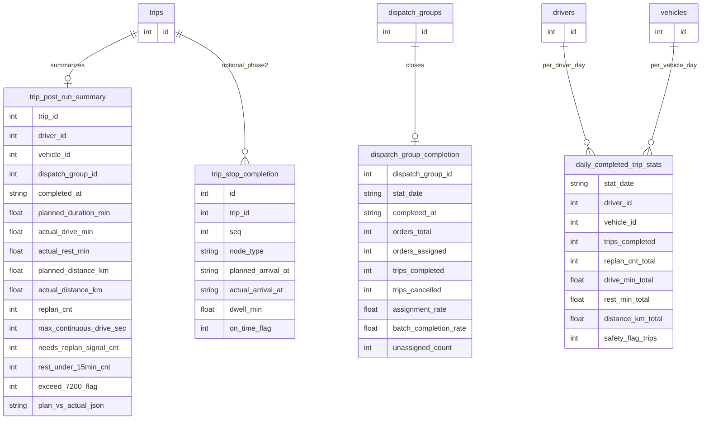
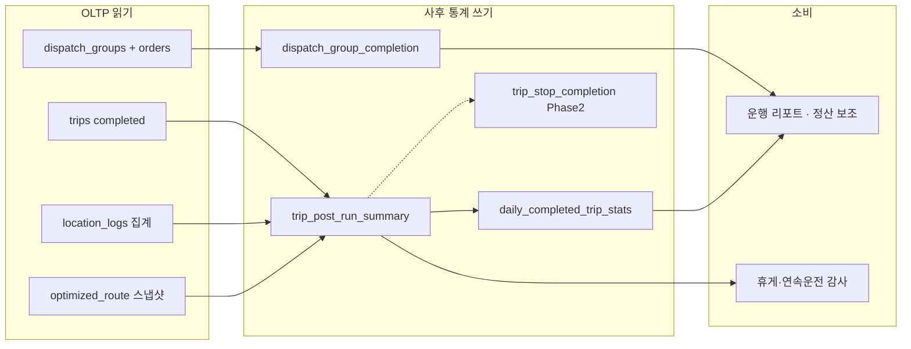

# RouteOn 운행 이후 사후 통계 ERD

> **성격:** `trips.status = completed` **이후**에 적재·조회하는 통계 스키마 **초안**. `README.md` Roadmap·`SCHEMA.md`·OLTP 모델과 정합. **팀장 확정 전 배치 job·분모 정책 단정 금지.**

**범위 밖 (별도 문서·모니터링):** VRPTW 실행 로그, 실시간 관제, `algorithm_events` / `dispatch_run_events` 중심 배차·알고리즘 품질 대시보드. 거래처 SLA·체류(하역) 기반 경영 KPI는 선택(Phase 2+)·별도.

안내·요약 ERD 미리보기: [STATS_ERD.md](STATS_ERD.md)

---

## 목적

운행이 **끝난 뒤**에만 답하는 질문에 집중한다.

| 관점 | 예시 질문 |
|------|-----------|
| **계획 vs 실제** | 계획 소요(주행+법정 휴게, 체류 제외) 대비 실제 주행·휴게·총 운행 시간은? |
| **완료·재계획** | 완료 Trip 수, Trip당 `replan` 횟수, 취소·미완료 비율은? |
| **안전 사후 검증** | 7200s 연속운전·6000s `needs_replan`·15분 휴게 미달이 **완료 Trip**에서 몇 건이었는가? |
| **배치 성과** | 배치(`dispatch_groups`) 종료 시 배정·완료·미배정 비율은? |
| **일 롤업** | 일·기사·차량별 완료 건수, km, replan 합계는? |

**ETA / 계획 시간 정의 (제품):** `estimated_duration_min` 및 계획 소요 = **주행 + 법정 휴게 삽입**; **상·하차 체류(하역)는 포함하지 않는다.** 사후 비교 시에도 동일 기준을 쓴다.

**적재 시점:** Trip `completed_at` 확정(또는 배치 `completed`) 후 배치 job / materialized view refresh. OLTP `trips`·`location_logs`는 **읽기만** 하고 통계 테이블에 스냅샷을 남긴다.

---

## ERD (Mermaid) — 사후 통계 테이블만

운영 OLTP 상세는 [SCHEMA.md](../SCHEMA.md). 아래 FK 대상(`trips`, `dispatch_groups`, `drivers`, `vehicles`)은 **id 참조만** 표기한다. Mermaid 호환을 위해 날짜·플래그는 `string` / `int`로 표기한다.

**테이블 요약**

| 테이블 | grain | 설명 |
|--------|-------|------|
| `trip_post_run_summary` | 1 Trip 완료 = 1행 (`trip_id`) | 계획 vs 실제, replan, 휴게·연속운전 사후 지표 스냅샷 |
| `dispatch_group_completion` | 1 배치 종료 = 1행 (`dispatch_group_id`) | 배정률·완료율·미배정 건수 (배치 단위 사후) |
| `daily_completed_trip_stats` | `stat_date` × `driver_id` × `vehicle_id` | 완료 Trip 롤업; null 조합은 전사 일계용 확장 가능 |
| `trip_stop_completion` | 노드별 (Phase 2) | 정차·체류·정시 도착; 경영 SLA와 분리해 선택 도입 |

---

## 데이터 흐름 (완료 후 적재)

---

## 지표 목록 (운행 이후)

### Trip (`trip_post_run_summary`)

| 지표 | 설명 | 원천(초안) |
|------|------|------------|
| `planned_duration_min` | 최종 계획 소요(주행+법정 휴게, 체류 제외) | 마지막 optimize/replan 응답 또는 `optimized_route` 메타 |
| `actual_drive_min` | 실제 주행 누적 | `trips.total_driving_seconds` / location 집계 |
| `actual_rest_min` | 실제 휴게 누적 | `trips.total_rest_seconds` |
| `planned_distance_km` / `actual_distance_km` | 계획·실제 거리 | GraphHopper 계획 vs GPS/로그 합산(정책 확정 필요) |
| `replan_cnt` | 운행 중 재계획 횟수 | replan API 호출 카운트(멱등 정책은 팀장 확정) |
| `max_continuous_drive_sec` | Trip 내 최대 연속운전 | `location_logs` |
| `needs_replan_signal_cnt` | 6000s 근접 신호 횟수 | `needs_replan` 이력 |
| `rest_under_15min_cnt` | 15분 미만 휴게 횟수 | 휴게 구간 파싱 |
| `exceed_7200_flag` | 7200s 초과 여부(0/1) | 연속운전 규칙 |
| `plan_vs_actual_json` | 세부 diff(선택) | 노드·구간별 delta JSON |

### 배치 (`dispatch_group_completion`)

| 지표 | 설명 |
|------|------|
| `orders_total` / `orders_assigned` | 배치 내 주문·배정 수 |
| `assignment_rate` | `orders_assigned / orders_total` |
| `trips_completed` / `trips_cancelled` | 배치 소속 Trip 종료 상태 |
| `batch_completion_rate` | 완료 Trip / (배정된 Trip 또는 주문) — 분모 정의 확정 필요 |
| `unassigned_count` | 미배정 주문 수(배치 **종료 시점** 스냅샷) |

### 일 롤업 (`daily_completed_trip_stats`)

| 지표 | 설명 |
|------|------|
| `trips_completed` | 해당 일·기사·차량 완료 건수 |
| `replan_cnt_total` | replan 합계 |
| `drive_min_total` / `rest_min_total` | 주행·휴게 합 |
| `distance_km_total` | 거리 합 |
| `safety_flag_trips` | `exceed_7200_flag` 또는 휴게 미달 Trip 수 |

### Phase 2 — 노드 (`trip_stop_completion`, 선택)

| 지표 | 설명 |
|------|------|
| `planned_arrival_at` / `actual_arrival_at` | 정차별 계획·실제 |
| `dwell_min` | 체류(하역); **계획 소요 비교에는 넣지 않음** |
| `on_time_flag` | 시간창 준수(0/1, 정의 확정 후) |

---

## 우선순위

| 우선순위 | 항목 | 비고 |
|----------|------|------|
| **P0** | `trip_post_run_summary` | Trip 완료 hook / 일배치 |
| **P0** | `daily_completed_trip_stats` | P0 Trip 요약에서 UPSERT |
| **P1** | `dispatch_group_completion` | `dispatch_groups.status = completed` 시 |
| **P2** | `trip_stop_completion` | 노드·SLA; 경영 KPI와 분리 |

Phase 0 임시: `trips` + `completed_at` 일자만으로 완료 건수·평균 운행시간 뷰 — **사후 테이블 없이** 시작 가능.

---

## 관련 문서

| 문서 | 설명 |
|------|------|
| [STATS_ERD.md](STATS_ERD.md) | 안내·요약 ERD 미리보기 |
| [SCHEMA.md](../SCHEMA.md) | 운영 OLTP |
| [README.md](../README.md) | 프로젝트 범위·Roadmap |

**팀장 handoff 후보:** replan 카운트 멱등, `batch_completion_rate` 분모, 거리 실측(GPS vs 엔진) 정책, 통계 DB 분리 여부 — 범위 확정 전 본 문서는 **초안**으로 유지.

---

[^ddl]: DDL 초안(예정)만 `backend/seeds/post_trip_stats_schema.sql` (엔지니어 후속). 레거시 `backend/seeds/stats_schema.sql`는 비어 있음.
