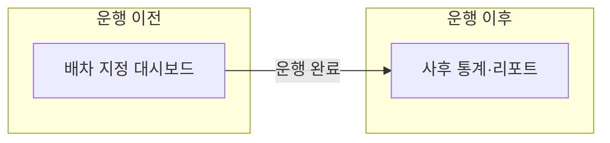

# RouteOn 관제 웹 — 토론용

> **팀장 승인 전 · 웹 팀 토론용** (저장 구조·집계 방식 미확정)

- **운행 이전** = 통계가 아니라 **배차·지정 대시보드**(뭘 넣고, 누구한테 배정할지 정하는 화면)
- **운행 이후** = **완료 Trip 사후 통계·리포트**

**알고리즘 내부:** 계획 소요는 주행+법정휴게(체류 제외). **관제 통계 화면에는 계획 vs 실제·주행/휴게/거리 비교·재경로 등은 노출하지 않음** (개발·감사용만).

## 운행 이전 — 배차·지정 대시보드

관제가 **화면에서 정하고 확인하는 것** (통계·집계 아님):

- 배송 건 입력·목록: 상차·하차 위치, 화주, 화물, 연락처, 희망 도착 시간 등
- 오늘(또는 선택 일)·권역·센터 기준으로 **어떤 묶음**을 배차할지 선택
- **가용 차량·기사** 체크(오늘 쓸 수 있는지) 후 배차 실행 버튼
- 배차 결과 **미리보기**: 차량별 방문 순서, 노드 위치(지도), 계획 소요·거리(주행+휴게)
- **미배정 건** 목록 + 수동 재배정·단건 배차로 넘기기
- 기사·차량에 Trip 생성·앱 전달 전, 관제가 마지막으로 순서·노드 확인하는 화면

## 운행 이후 — 관제·기업 관리자용

**보여줄 것** (운영·안전·배정 중심):

- 배차 직후: **배정 완료 / 미배정**
- Trip **완료 / 진행 중 / 취소 / 미완료** 건수
- **기사별** (기간 선택): 완료 Trip 몇 건, **운행 시간·거리 합**, 운행한 날 수
- **차량별**도 동일하게 (선택)
- **안전 이슈** Trip 건수 (적합/주의 수준만)
- (선택) 하차·상차 머문 시간 — 경영용
- (선택) 낮·밤 운행 비율

**감춤** (개발·내부용): 계획 vs 실제, 주행·휴게·거리 상세, 재경로 횟수, 휴게소 방문 횟수 등

